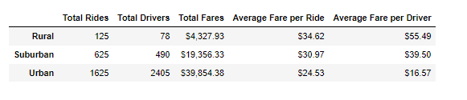
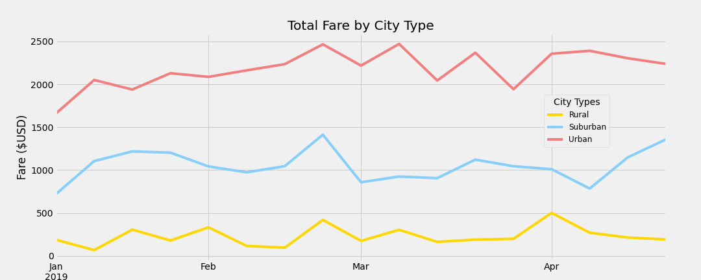

# Overview of the analysis

In the project I am creating a summary DataFrame of the ride-sharing data by city type (Urban, Suburban or Rural). The analysis talks about
how the data is varied by the type of city so that it will help Pyber improve access to ride-sharing services.Then, using Pandas and Matplotlib,
I have created a multiple-line graph that shows the total weekly fares for each city type. 

# Results

## A ride-sharing summary DataFrame by city type

- The total number of rides, total number of drivers, and the total fares for each city type has been ascertained using Pandas groupby() function 
  with the count() and sum() methods on PyBer DataFrame columns
- Then average fare per ride and average fare per driver for each city type has been calculated 
- Finally this data has been added to a new dataframe and then the columns have been formated. 

  
##  A multiple-line chart of total fares for each city type

- Using Pandas, two new functions pivot() and resample(), a multiple-line graph has been created that shows the total fares for each week by 
  city type.

# Summary

Three business recommendations to the CEO for addressing any disparities among the city types
- Drivers can be shuffled between urban cities can also be shifted to suburban and rural areas
- Drivers can be offered some perks to work in the rural areas
- Work twowards increasing profitability in urban cities
